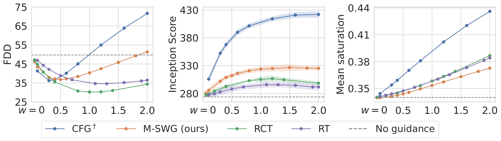
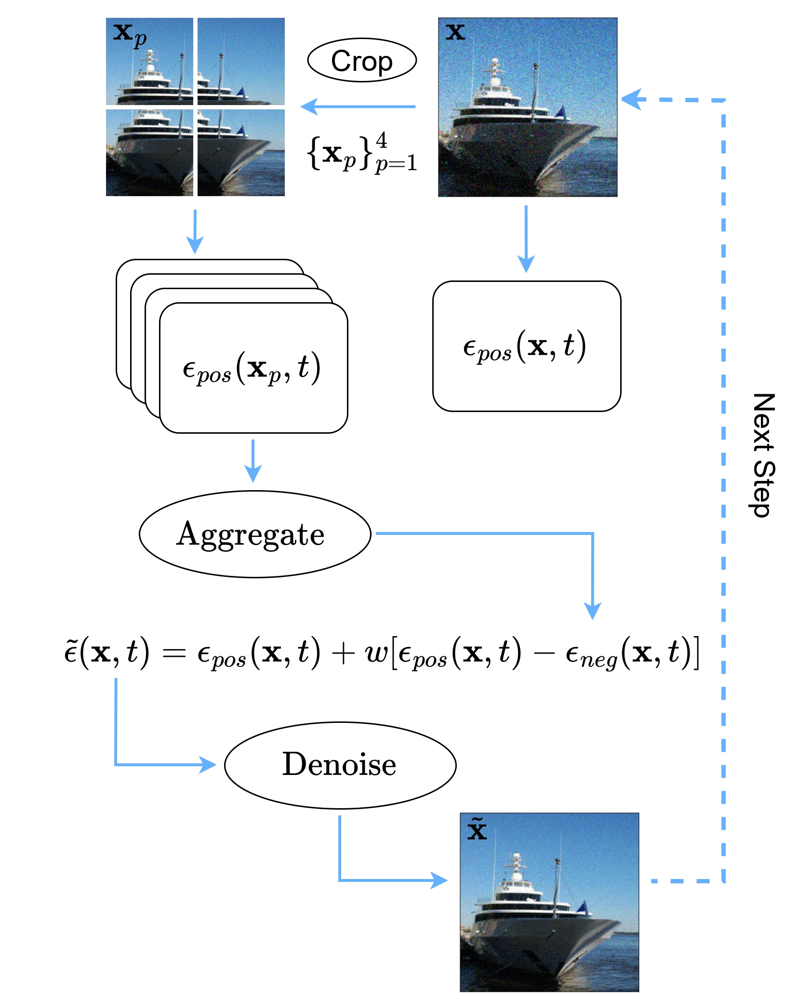
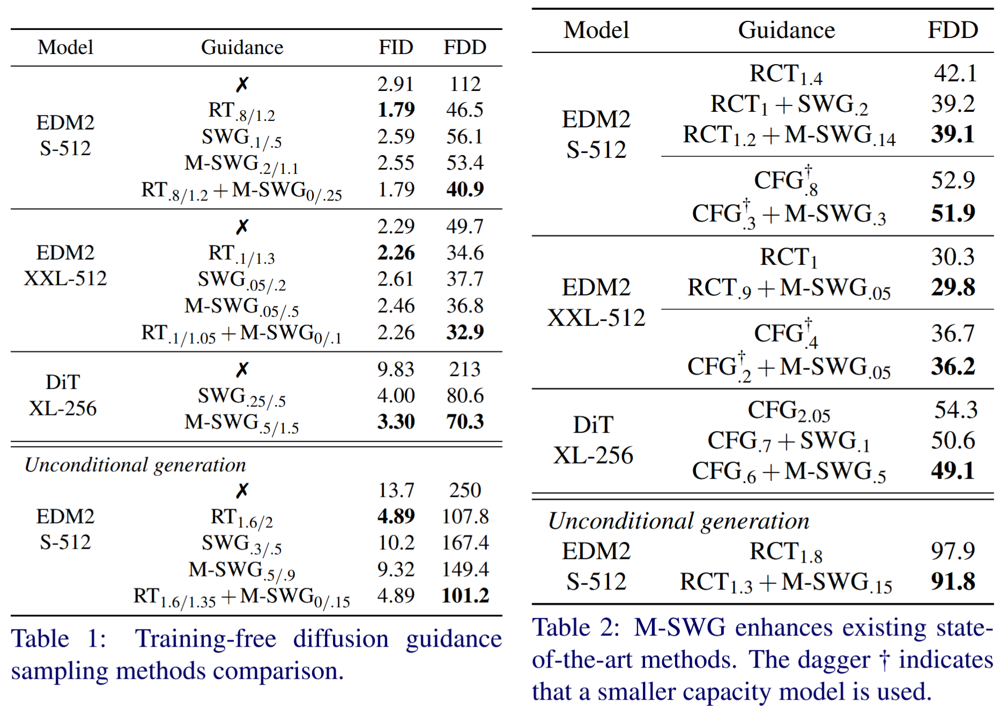
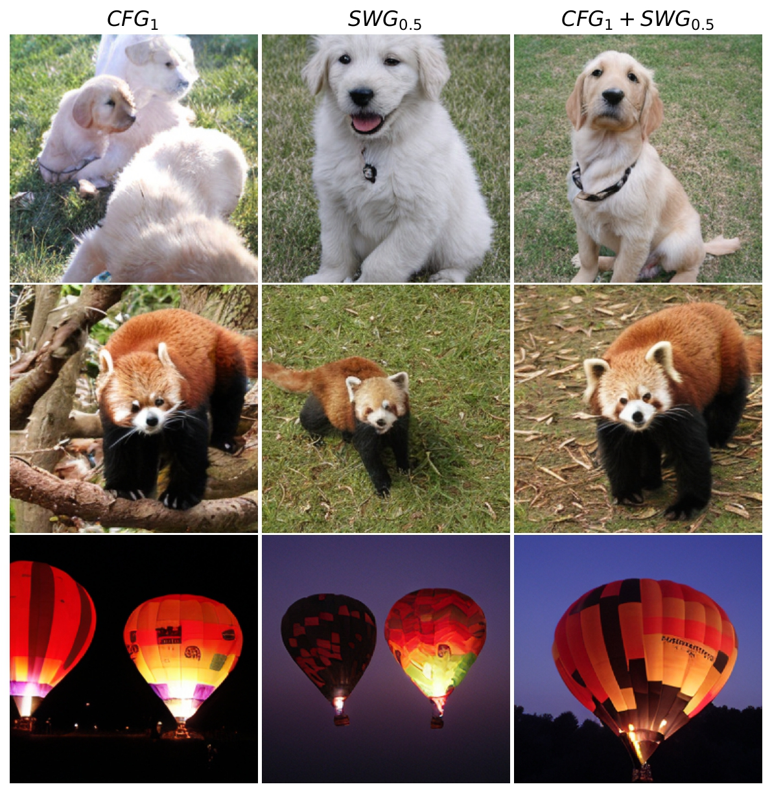
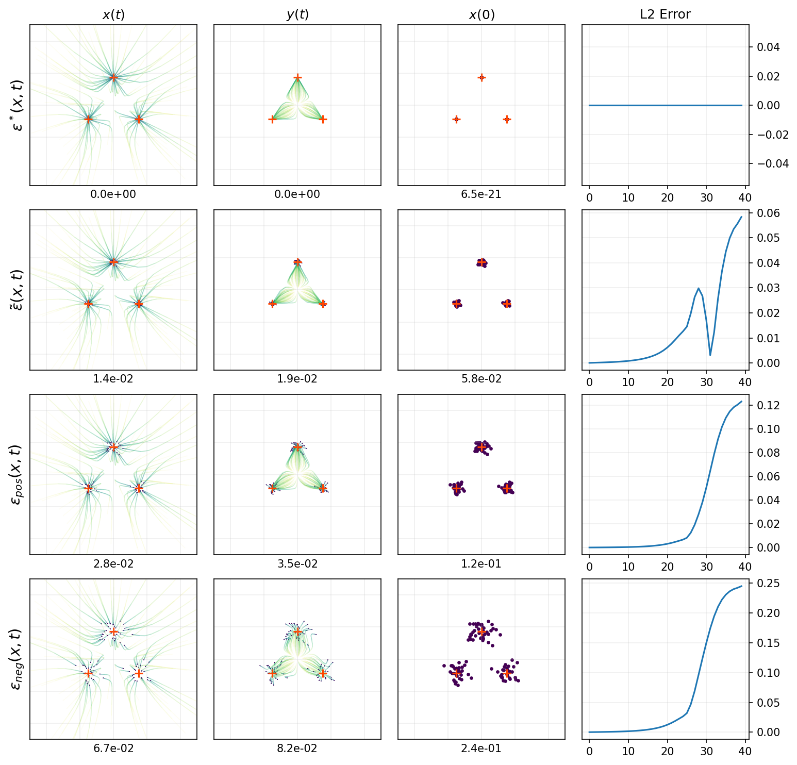

<div align="center">

<!-- TITLE -->
# [BMVC 2025] - **Guiding a diffusion model with itself using sliding windows** :fire:

[ :scroll: [`Arxiv`](https://arxiv.org/abs/2411.10257)]  [ :book: [`BibTeX`](#citation)]

<!-- [ :globe_with_meridians:  [`youtube`](todo)] -->

<p align="center">
  <br>
  <em>Visualizing the achieved tradeoff achieved by masked sliding window guidance (M-SWG). We vary the guidance scale w (x-axis) for the Frechet DINOv2 distance (FDD, left), Inception score (IS, center), and saturation (right) using the class conditional EDM2-XXL at 512x512 resolution. RT stands for reduced training, RCT for reduced capacity and training (also known as autoguidance), and CFG for classifier-free guidance. Saturation is quantified as the mean channel intensity in HSV color space (S channel).</em>
</p>


 <!--  [](TODo_YOUTUBE_LINK) -->
 


[Nikolas Adaloglou](https://www.linkedin.com/in/adaloglou17/), Tim Kaiser, Damir Iagudin and Prof. Markus Kollmann

**[Mathematical modeling of biological systems lab (MMBS), Heinrich Heine University of Dusseldorf](https://github.com/HHU-MMBS/)**


  <!-- [](https://proceedings.bmvc2023.org/297/)  --> 
  
  [](https://arxiv.org/abs/2411.10257)  
 
</div>

# Abstract and Method Overview


Guidance is a widely used technique for diffusion models to enhance sample quality. Technically, guidance is realised by using an auxiliary model that generalises more broadly than the primary model. Using a 2D toy example, we first show that it is highly beneficial when the auxiliary model exhibits similar but stronger generalisation errors than the primary model. Based on this insight, we introduce masked sliding window guidance (M-SWG), a novel, training-free method. M-SWG upweights long-range spatial dependencies by guiding the primary model with itself by selectively restricting its receptive field. M-SWG requires neither access to model weights from previous iterations, additional training, nor class conditioning. M-SWG achieves a superior Inception score (IS) compared to previous state-of-the-art training-free approaches, without introducing sample oversaturation. In conjunction with existing guidance methods, M-SWG reaches state-of-the-art Frechet DINOv2 distance on ImageNet using EDM2-XXL and DiT-XL.

Recent guidance methods utilize the linear extrapolation scheme of classifier-free guidance (CFG), given by

$$\tilde{\epsilon}(x,t) = \epsilon_{\text{pos}}(x,t) + w\left[\epsilon_{\text{pos}}(x,t) - \epsilon_{\text{neg}}(x,t)\right],$$ 

where the subscripts *pos* for positive and *neg* for negative refer to the sign of the noise predictors. Assuming that a significant source of the predictor's error can be attributed to long-range dependencies, we introduce a new guidance method that aims to correct such errors. The idea is to generate $\mathbf{\epsilon_{\text{neg}}}$ by restricting the spatial input size ($H \times W$) of $\mathbf{\epsilon_{\text{pos}}}$ to a smaller size $k \times l$, with $k<H$ and $l<W$, which induces a defined cut-off for long-range dependencies. We use sliding windows to generate $N$ crops of size $k \times l$, using a fixed stride $s$ per dimension. These crops are independently processed (without rescaling) by $\mathbf{\epsilon_{\text{pos}}}$ as illustrated below. The $N$ predictions of $\mathbf{\epsilon_{\text{pos}}}$ are superimposed in the same order and at the same positions, which results in an $H\times W$ output for $\mathbf{\epsilon_{\text{neg}}}$. Overlapping pixels are averaged.


SWG is currently implemented for the EDM2 and the DiT pretrained diffusion models for sampling. See the subfolders' [README](edm2/README.md)


# Main results
<p align="center">

</p>

Below is an illustration of combining CFG with SWG using the publicly available DiT-XL checkpoint:
<p align="center">

</p>

### Toy model
The described 2D toy model (section 2 in the main paper) can be found in the [toy_example](toy_example/toy_model.ipynb) notebook. You can adjust the parameters in the notebook.


<p align="center">

</p>

# Licence and information
We adapt the codebase of EDM2 and DiT to demonstrate the effectiveness of SWG and M-SWG. The EDM2 codebase is based on the official EDM2 repository https://github.com/NVlabs/edm2  and, as a result, follows their licence (`edm2/LICENCE.txt`), namely Attribution-NonCommercial-ShareAlike 4.0 International.  

This code is adapted from the [official DiT repo](https://github.com/facebookresearch/DiT), and as a result, the code and model weights are licensed under CC-BY-NC. See [`edm2/LICENSE_DIT.txt`](LICENSE.txt) for details. We applied minimal changes to the sampling code. See the individual `README.md` in each subfolder for `edm2` and `DiT` for more information.

# Citation
For research inquiries, contact [Nikolas Adaloglou](https://www.linkedin.com/in/adaloglou17/) and/or Prof. Markus Kollmann at the email addresses mentioned in the paper. 

If you find our work useful, please star this repo and cite us in your work as:
```bibtex
@inproceedings{adaloglou2025swg,
author    = {Nikolas Adaloglou and Tim Kaiser and Damir Iagudin  and Markus Kollmann},
title     = {Guiding a diffusion model with itself using sliding windows},
booktitle = {36th British Machine Vision Conference, {BMVC} 2025, November 2025, Sheffield, UK},
publisher = {BMVA},
year      = {2025},
}
```

