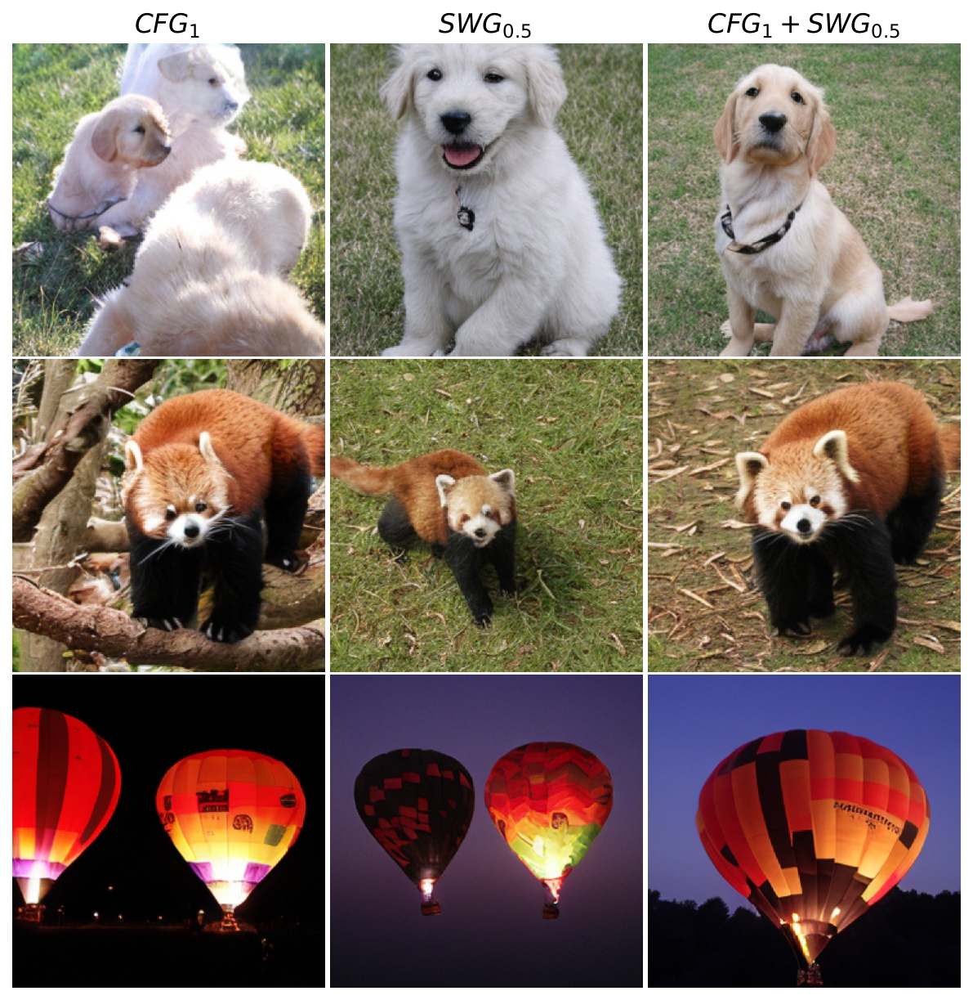

# Visualizations with DiT
The notebook `run_DiT_cfg_SWG.ipynb` provides a few visualizations for all sampling methods. We used this script to generate the supplementary figures.

[](dit_cfg_swg)

<details>
<summary><span style="font-size: 1.6em; ; font-weight: bold;">Install UV package manager (recommended)</span></summary>

# Setup virtual enviroments


```bash
curl -LsSf https://astral.sh/uv/install.sh | sh
```

### Create a virtual environment based on the pyproject.toml (Linux)
```bash
cd code
uv sync
```

### Activate the environment
```bash
source .venv/bin/activate
wandb login
```

</details>

<details>
<summary><span style="font-size: 1.6em; ; font-weight: bold;">Anaconda package manager</span></summary>

Below is relevant information on how we have generated our results.

```bash
conda create --name edm2 python=3.10
conda activate edm2
pip install numpy==1.25 wandb
wandb login
```

### Install Pytorch based on the specifications of your system
For more versions see https://pytorch.org/get-started/previous-versions/ 
For instance:
```
pip install torch==1.12.1+cu116 torchvision==0.13.1+cu116 torchaudio==0.12.1 --extra-index-url https://download.pytorch.org/whl/cu116
```

### Additional dependencies
```
pip install huggingface-hub==0.25.1
pip install click Pillow psutil requests pandas scipy tqdm 
pip install diffusers==0.26.3 accelerate==0.27.2
```
</details>

</br>

# EDM2: Sampling with M-SWG and variants
### Using torchrun directly
Here is an example on how to reproduce the results with RCT+ M-SWG, where `--scale_window_guide 1` enables the masked version of SWG (use 0 for naive SWG) and `g_weight` is the guidance scale $w$. For `g_weight` you need to pass 2 values separated by comma when a combination of guidance methods is applied.

```bash
torchrun --standalone --nproc_per_node=4 sample_edm2.py \
--net_pos_pkl https://nvlabs-fi-cdn.nvidia.com/edm2/raw-snapshots/edm2-img512-s/edm2-img512-s-2147483-0.100.pkl \
--net_neg_pkl https://nvlabs-fi-cdn.nvidia.com/edm2/raw-snapshots/edm2-img512-xs/edm2-img512-xs-0134217-0.100.pkl \
--outdir ./samples/IN512/s/RCT_SWG/1.2_0.14/samples/ \ 
--swg_sizes 40 --swg_steps 2 --seeds 0-49999 --use_wandb 0  \
--subdirs --batch 1024 --metrics fid,fd_dinov2 \
--ref_path https://nvlabs-fi-cdn.nvidia.com/edm2/dataset-refs/img512.pkl \ 
--g_weight 1.2,0.14 --g_method wmg-swg --scale_window_guide 1 --g_interval none 
```

To run M-SWG using EDM2-S:

```bash
torchrun --standalone --nproc_per_node=4 sample_edm2.py \
--net_pos_pkl https://nvlabs-fi-cdn.nvidia.com/edm2/raw-snapshots/edm2-img512-s/edm2-img512-s-2147483-0.100.pkl \
--outdir ./samples/IN512/s/MSWG/0.2/samples/ --seeds 0-49999 --subdirs --batch 1024 \ 
--metrics fid,fd_dinov2 \ 
--ref_path https://nvlabs-fi-cdn.nvidia.com/edm2/dataset-refs/img512.pkl \ 
--g_weight 0.2 --g_method swg --swg_sizes 40 --swg_steps 2 --scale_window_guide 1
```

Supported guidance methods (`g_method`) are `swg, wmg-swg, wmg, cfg, cfg_swg`. 

### Bash scripts: Generate images with RCT+SWG  
Variables to modify in the [bash script](bash/generate_wmg_swg.sh) if needed to reproduce results. Here we share the reproduced results with EDM2 S with the most important parameters you can tweak:   

```bash
base_out_dir="./samples" # where to save the data, folder needs to exist
batch=256
resolution=512
metrics='fid,fd_dinov2' # metrics to calculate when =50K images are sampled
seeds="0-255" # how many images to produce
swg_sizes="40" # crop size, k in the paper
swg_steps="2" # number of crops per dimension 
model_size="s" # Uses EDM-S
g_method='wmg-swg' # combines M-SWG with the negative model specified below 
negative='RT' # choose between reduced training (RT), or reduced capacity and training (RCT)
poll=1 # whether to poll gpu space or not
g_weight="1.2,0.25"
```

### Hyperparameters and results

The results below were reproduced using this codebase to ensure reproducibility.

| Models | Guidance | g_weight ($w$) | FID | FDD |
|-------|-------|-------|-------|-------|
| EDM2 S |   RT+M-SWG    |   1.2, 0.25    |     3.35  |    40.94   |
| EDM2 S | RCT+ M-SWG       |   1.2, 0.14    |      3.22 | 39.17       |
| EDM2 S | M-SWG      |     0.2  |    2.55   | 81.35      |
| EDM2 S | M-SWG      |    1.1   |   4.96    | 53.45      |
| EDM2 S | CFG+M-SWG      |    0.3, 0.3   |  7.57     | 51.86       |

The above guidance weights are optimized for FDD based on a hyperparameter search. More combinations of guidance weights can be found in Tables 1 and 2 in the main paper.


# Results and sampling with DiT-XL

For evaluations you need to have the 256 dataset references for the FID/FDD
```
cd code
mkdir dataset_refs 
wget https://uni-duesseldorf.sciebo.de/s/zBPX4e9fsW6rdBQ/download/img256.pkl

```

You can use the provided bash scripts in:
```bash
source .venv/bin/activate
# choose sampling method
bash bash/dit_swg.sh
bash bash/dit_cfg_swg.sh
```

Or use `torchrun` directly. Below, M-SWG is applied for the DiT-XL 256 model.

For M-SWG:
```bash
torchrun --standalone --nproc_per_node=4 sample_dit.py \ 
    --model DiT-XL/2 --num-fid-samples 50000 --g-scale 0.5 --per-proc-batch-size 32 \ 
    --crop 1 --mask 1  --sample-dir "./samples/IN256/cond_DiT_MSWG"
```
Crop (`--crop 1`) applied SWG sampling and `--mask 1` uses masked SWG.

For CFG+M-SWG:

```bash
torchrun --standalone --nproc_per_node=$nproc_per_node sample_dit.py --save_tar \ 
    --model DiT-XL/2 --num-fid-samples 50000 --g_scale 0.6 --per-proc-batch-size 32 \ 
    --cfg_crop 1 --crop_scale 0.5 --mask 1 --sample-dir "./samples/IN256/cond_DiT_CFG_MSWG"
```


**WARNING**: Outdir (`--sample-dir`) need to be specified in the bash scripts. The results below were reproduced using this codebase to ensure reproducibility.

| Models | Guidance | weight ($w$) | FID | FDD |
|-------|-------|-------|-------|-------|
| DiT-XL |   M-SWG    |   0.5   |  5.97 | 79.95    |
| DiT-XL | M-SWG       |  1.5   |    5.62  | 70.3         |
| DiT-XL | RCT+ M-SWG       |  0.6, 0.5  |   6.79 | 49.97    |
| DiT-XL | RCT+ SWG       |  0.7, 0.1  |  6.24    |  50.14     |


## Implementation of SWG
If you want to take a look in the implementation, see [line 75 in sample_edm2.py](sample_edm2.py#L75)

## Licenses
**EDM2**: This codebase is heavily based on official EDM2 repository. The licenses follow the [offical EDM2 and Autoguidance repository](https://github.com/NVlabs/edm2/tree/main)
Copyright &copy; 2024, NVIDIA CORPORATION & AFFILIATES. All rights reserved. All material, including source code and pre-trained models, is licensed under the [Creative Commons Attribution-NonCommercial-ShareAlike 4.0 International License](http://creativecommons.org/licenses/by-nc-sa/4.0/). See [`LICENSE_EDM2.txt`](LICENSE_EDM2.txt) for details.


**DiT**: The official DiT code and model weights are licensed under CC-BY-NC. This codebase is adapted from the official DiT repo and as a result, the code and model weights are licensed under CC-BY-NC. See [`LICENSE.txt`](LICENSE_DIT.txt) for details. We applied minimal changes in the sampling code.

